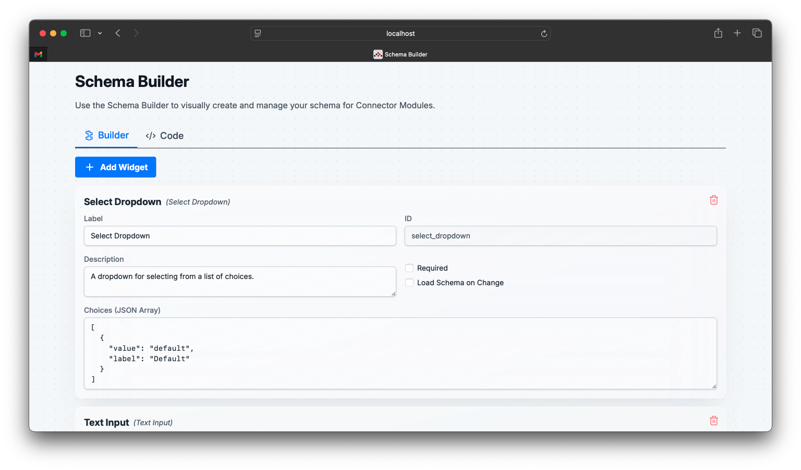
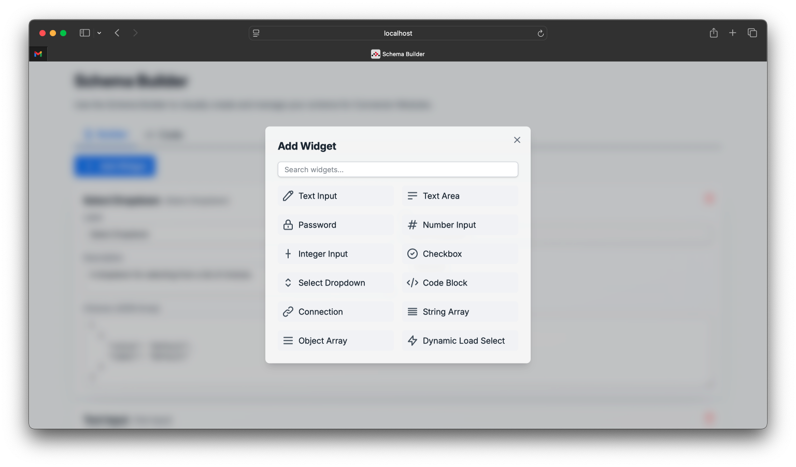
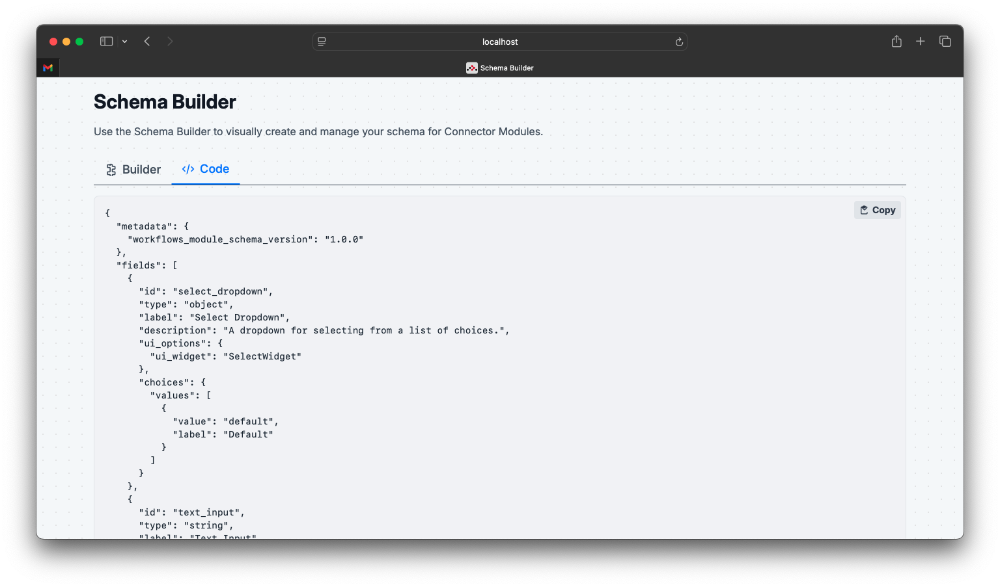

# Schema Builder 

This project features a visual schema builder, allowing users to intuitively design and manage data schemas through a user-friendly interface. The generated schema can be viewed and copied in JSON format.

### Visual Builder

Design your schema by adding and configuring various widgets. The interface provides a clear overview of your schema structure.



### Add Widget Modal

Easily add new fields to your schema using a modal that lists available widget types. This modal features a search function for quick access.



### Code View

View the generated JSON schema in real-time as you build it visually. The code is formatted for readability and can be easily copied.



## Getting Started

### Installation

Install the dependencies:

```bash
npm install
```

### Development

Start the development server with HMR:

```bash
npm run dev
```

Your application will be available at `http://localhost:5173`.

## Building for Production

Create a production build:

```bash
npm run build
```

## Deployment

### Docker Deployment

To build and run using Docker:

```bash
docker build -t my-app .

# Run the container
docker run -p 3000:3000 my-app
```

The containerized application can be deployed to any platform that supports Docker, including:

- AWS ECS
- Google Cloud Run
- Azure Container Apps
- Digital Ocean App Platform
- Fly.io
- Railway


```
Built with ❤️ by Solomon Mithra.
```
